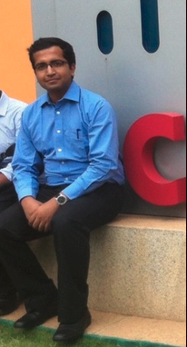

> If we knew what it was we were doing, it would not be called research, would it?     

## Brief Bio
<!--!-->

I am currently a PhD candidate at Department of Computer Science in Stony Brook Univeristy. From fall 2018 I'm working in the [Computer Vision Lab](https://www3.cs.stonybrook.edu/~cvl/) under the supervision of [Prof. Dimitris Samaras](https://www3.cs.stonybrook.edu/~samaras/).

In Summer and Fall 2025, I interned as an **Applied Scientist in Amazon**. Where I applied reinforcement learning and Chain-of-Thought to train a multimodal agent (MLLM) to use a set of tools (foundational models) to find visual defects in customer uploaded images. We improved the classification performance by **6.1%**. 

Prior to this, I received my master degree from National Institute of Technology, Calicut, India in 2016 advised by [Prof. Sudeep K S](http://people.cse.nitc.ac.in/sudeep/).

**Research Interest:** I work on research problems in Computer Vision and Machine Learning. I am especially interested in the field of using Unsupervised techniques for performing object detection and Fine Grained Classification.

**Industry Experience:** I have worked as Senior Software Developer in Cisco for 2 years and prior to that I have almost two years experience in Wipro Technologies as a Project Engineer.

### **[Resume(2019.08)](https://github.com/prantikhowlader/prantikhowlader.github.io/raw/master/prantik_resume.pdf)**

## Contact
 - Email : phowlader[at]cs.stonybrook.edu
 - Room 138, New Computer Science Building, Stony Brook University, Stony Brook, NY 11794-2424
 
## Publications
- ***Prantik Howlader***, Srijan Das, Hieu Le and Dimitris Samaras. “Beyond Pixels: Semi-Supervised Semantic Segmentation with a Multi-scale Patch-based Multi-Label Classifier”. In European Conference on Computer Vision (**ECCV 2024**) ([Paper](https://github.com/prantikhowlader/prantikhowlader.github.io/raw/master/beyond_eccv.pdf))
- ***Prantik Howlader***, Hieu Le and Dimitris Samaras. “Weighting Pseudo-Labels via High-Activation Feature Index Similarity and Object Detection for Semi-Supervised Segmentation”. In European Conference on Computer Vision (**ECCV 2024**) ([Paper](https://github.com/prantikhowlader/prantikhowlader.github.io/raw/master/weighing_eccv.pdf))
- ***Prantik Howlader***, Vu Nguyen, Le Hou, Rajarshi Gupta, Dimitris Samaras and Joel Saltz. “Few Shot Hematopoietic Cell Classification”. In  Medical Imaging with Deep Learning (**MIDL 2023**) ([Paper](https://github.com/prantikhowlader/prantikhowlader.github.io/raw/master/midl.pdf))
-  Ayush Kumar, ***Prantik Howlader***, Rafael Garcia, Daniel Weiskopf and Klaus Mueller. “Challenges in Interpretability of Neural Networks for Eye Movement Data”. In ACM Symposium on Eye Tracking Research and Applications (**ETRA 2020**) ([Paper](https://github.com/prantikhowlader/prantikhowlader.github.io/raw/master/etra.pdf))
- ***Prantik Howlader1***, Aditya Chattopadhyay1, Anirban Sarkar1 and Vineeth N. Balasubramanian.“Grad-CAM++: Generalized Gradient-based Visual Explanations for Deep Convolutional Networks,” IEEE Winter Conference on Applications of Computer Vision (**WACV 2018**) ([Paper](https://github.com/prantikhowlader/prantikhowlader.github.io/raw/master/gradcam%2B%2B.pdf))
 (1 All authors have contributed equally)
- ***Prantik Howlader***, Kuntal Kumar Pal, Alfredo Cuzzocrea, and S. D. Madhu Kumar. “Predicting Facebook-Users’ Personality based on Status and Linguistic Features via Flexible Regression Analysis Techniques,” In Proceedings of ACM SAC Conference (**SAC 2018**) ([Paper](https://github.com/prantikhowlader/prantikhowlader.github.io/raw/master/eigen.pdf))
- ***Prantik Howlader*** and K.S. Sudeep.“Degree Centrality, Eigen vector Centrality and relation between them in Twitter,” IEEE International Conference on Recent Trends in Electronics, Information & Communication Technology (**RTEICT 2016**) ([Paper](https://github.com/prantikhowlader/prantikhowlader.github.io/raw/master/fbk.pdf))

